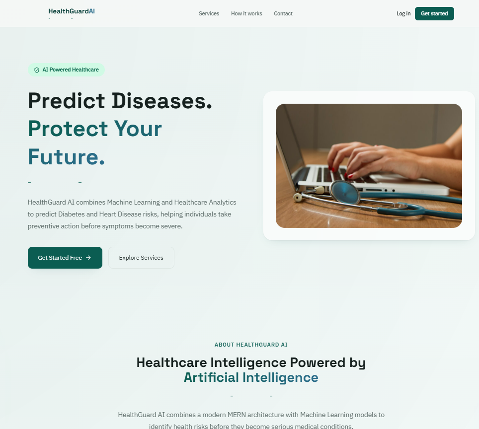
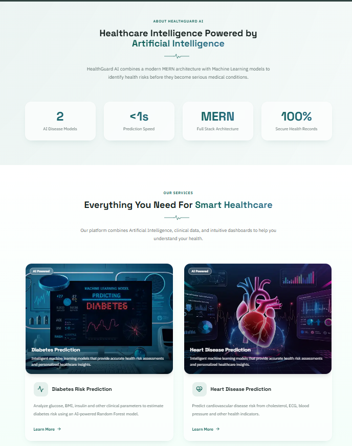
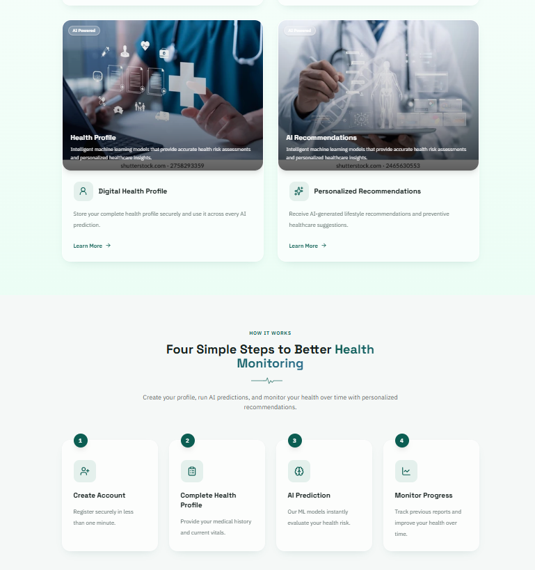

# HealthGuard AI

**AI-based personalized health risk prediction and monitoring system.**

HealthGuard AI predicts a user's risk of **diabetes** and **heart disease** from their health data using machine learning, then turns that prediction into a clear risk level, confidence score, and personalized recommendations. It's a full-stack project combining a MERN-style web app (with Firebase Authentication) and a standalone FastAPI machine learning service.

**Live app:** [https://health-guard-ai-psi.vercel.app](https://health-guard-ai-psi.vercel.app)
**Backend API:** [https://healthguard-ai-1yjn.onrender.com](https://healthguard-ai-1yjn.onrender.com)
**ML service:** [https://healthguard-ai-1-0waw.onrender.com](https://healthguard-ai-1-0waw.onrender.com)

## Preview

<p align="center">
  
</p>

<p align="center">
  
</p>

<p align="center">
  
</p>

---

## Table of contents

- [Preview](#preview)
- [Overview](#overview)
- [Features](#features)
- [Architecture](#architecture)
- [Tech stack](#tech-stack)
- [Project structure](#project-structure)
- [Getting started](#getting-started)
  - [Prerequisites](#prerequisites)
  - [1. ML service (FastAPI)](#1-ml-service-fastapi)
  - [2. Backend (Express)](#2-backend-express)
  - [3. Frontend (React)](#3-frontend-react)
- [Environment variables](#environment-variables)
- [API reference](#api-reference)
- [Machine learning models](#machine-learning-models)
- [User flow](#user-flow)
- [Deployment](#deployment)
- [Roadmap](#roadmap)
- [Disclaimer](#disclaimer)

---

## Overview

The platform lets a user:

1. Create an account with email/password or Google Sign-In, both handled by **Firebase Authentication**.
2. Build a health profile — vitals, lifestyle, and medical history.
3. Run an AI risk check for diabetes or heart disease by entering recent lab/checkup values.
4. Get back a risk level (Low/Medium/High/Critical), a confidence score, and specific recommendations.
5. Track every past prediction from a history view and see a summary on the dashboard.

## Features

- 🔐 **Authentication** — email/password and Google Sign-In via Firebase Authentication on the client; the Express API verifies each request's Firebase ID token server-side using the Firebase Admin SDK (no passwords or OAuth credentials touch the backend directly)
- 🩺 **Health profile management** — vitals, lifestyle, medical history, blood group, etc., stored in MongoDB
- 🧠 **Two ML-backed risk models** — Random Forest classifiers for diabetes and heart disease, served from an independent FastAPI microservice
- 📊 **Dashboard** — BMI, latest risk per condition, a risk-level breakdown chart, and recent activity
- 📜 **Prediction history** — every prediction is stored and viewable later
- 🎨 **Public marketing site** — landing page with project info, services, and contact details, separate from the authenticated app

## Architecture

```
                     ┌────────────────┐        ┌──────────────────────┐
   Browser  ───────► │  React (Vite)  │──────► │  Firebase Auth        │
                     │    client/     │        │  (email/pass, Google) │
                     └───────┬────────┘        └──────────────────────┘
                             │ REST (Firebase ID token)
                             ▼
                     ┌────────────────┐        ┌──────────────────┐
                     │ Express API    │──────► │  MongoDB          │
                     │   server/      │        │  (Atlas)          │
                     └───────┬────────┘        └──────────────────┘
                             │ verifies token via
                             │ Firebase Admin SDK
                             │
                             │ REST (internal)
                             ▼
                     ┌────────────────┐
                     │  FastAPI ML    │
                     │  ml-service/   │
                     │  (scikit-learn)│
                     └────────────────┘
```

The frontend authenticates directly with Firebase and attaches the resulting ID token to every API request. The Express API never sees a password or Google credential — it only verifies the Firebase-issued token, then uses MongoDB purely for profile data, health records, and predictions (Firebase is not used as a data store). It calls the ML service internally to get a prediction before saving and returning the result.

## Tech stack

| Layer      | Technology |
|------------|------------|
| Frontend   | React 19, Vite, React Router, Tailwind CSS v4, React Hook Form + Zod, Recharts, Lucide icons, react-hot-toast, Firebase JS SDK (Authentication + Analytics) |
| Backend    | Node.js, Express 5, MongoDB + Mongoose, Firebase Admin SDK (ID token verification), Helmet, express-validator |
| ML service | Python, FastAPI, scikit-learn (Random Forest), pandas, NumPy, joblib |

## Project structure

```
HealthGuard-AI/
├── client/                  # React frontend (Vite)
│   └── src/
│       ├── api/             # Axios instance (attaches Firebase ID token)
│       ├── components/      # Layout, Sidebar, Navbar, GoogleAuthButton, cards, etc.
│       ├── context/         # AuthContext (Firebase session, email/password + Google)
│       ├── firebase.js      # Firebase app init (Auth, Analytics)
│       └── pages/           # Home, Login, Register, Dashboard, HealthProfile,
│                             # DiabetesPrediction, HeartPrediction,
│                             # PredictionResult, History, Profile
│
├── server/                  # Express backend
│   ├── config/               # firebaseAdmin.js — Firebase Admin SDK init
│   ├── controllers/          # auth (sync/me), health profile, prediction
│   ├── models/                # User (keyed by firebaseUid), HealthProfile, Prediction
│   ├── routes/                 # /api/auth, /api/health, /api/predictions
│   ├── services/                # ml.service (calls the ML API)
│   ├── middleware/               # Firebase token verification guard, validation, errors
│   └── validators/
│
└── ml-service/               # FastAPI ML microservice
    ├── api/                  # /predict/diabetes, /predict/heart
    ├── core/                 # config (paths, host/port)
    ├── schemas/               # Pydantic request models
    ├── services/               # model loading + prediction logic
    ├── training/                # train.py — trains and exports the .pkl models
    ├── models/                    # diabetes.pkl, heart_disease.pkl (trained models)
    └── datasets/                    # training datasets
```

## Getting started

### Prerequisites

- Node.js 18+
- Python 3.10+
- MongoDB (local instance or a free [MongoDB Atlas](https://www.mongodb.com/atlas) cluster)
- A [Firebase](https://console.firebase.google.com/) project with **Email/Password** and **Google** enabled under Authentication → Sign-in method
- A Firebase Admin SDK service account key (Project Settings → Service Accounts → Generate new private key) for the backend

Run all three services in three separate terminals — they don't share a process.

### 1. ML service (FastAPI)

```bash
cd ml-service
python -m venv venv
pip install -r requirements.txt
uvicorn main:app --reload --port 8000
```

Runs at `http://localhost:8000`. Visit `http://localhost:8000/docs` for the interactive Swagger UI.

> Trained models already ship in `ml-service/models/` (`diabetes.pkl`, `heart_disease.pkl`). To retrain them from the datasets in `ml-service/datasets/`, run `python training/train.py`.

### 2. Backend (Express)

```bash
cd server
npm install
npm run dev                # nodemon, or `npm start` for production
```

Runs at `http://localhost:5000`.

### 3. Frontend (React)

```bash
cd client
npm install
npm run dev
```

Runs at `http://localhost:5173`.

Once all three are running, open `http://localhost:5173` — you should land on the public home page.

## Environment variables

**`server/.env`**

| Variable | Description |
|---|---|
| `PORT` | Port for the Express API (default `5000`) |
| `MONGO_URI` | MongoDB connection string |
| `CLIENT_URL` | Frontend origin, for CORS (e.g. `http://localhost:5173`, no trailing slash) |
| `ML_SERVICE_URL` | Base URL of the FastAPI service (`http://localhost:8000`) |
| `FIREBASE_PROJECT_ID` | Firebase project ID, from the service account JSON |
| `FIREBASE_CLIENT_EMAIL` | Service account client email, from the service account JSON |
| `FIREBASE_PRIVATE_KEY` | Service account private key, from the service account JSON (keep the literal `\n` sequences and surrounding quotes intact) |

**`client/.env`**

| Variable | Description |
|---|---|
| `VITE_API_URL` | Base URL of the Express API, **including `/api`** (e.g. `http://localhost:5000/api`) |
| `VITE_FIREBASE_API_KEY` | Firebase web app config value |
| `VITE_FIREBASE_AUTH_DOMAIN` | Firebase web app config value |
| `VITE_FIREBASE_PROJECT_ID` | Firebase web app config value |
| `VITE_FIREBASE_STORAGE_BUCKET` | Firebase web app config value |
| `VITE_FIREBASE_MESSAGING_SENDER_ID` | Firebase web app config value |
| `VITE_FIREBASE_APP_ID` | Firebase web app config value |
| `VITE_FIREBASE_MEASUREMENT_ID` | Firebase web app config value (optional) |

All seven `VITE_FIREBASE_*` values come from Firebase Console → Project Settings → General → Your apps → SDK setup and configuration.

> **Note:** none of the Firebase values above are secret in the traditional sense — the web API key and Admin SDK client email are safe to expose in a client bundle or CORS-restricted API. The **`FIREBASE_PRIVATE_KEY`** is the one genuinely sensitive value and must never be committed to git or exposed to the frontend.

## API reference

All Express endpoints are prefixed with `/api`. Protected routes require `Authorization: Bearer <firebase-id-token>`, where the token comes from the Firebase JS SDK on the client (`currentUser.getIdToken()`).

| Method | Endpoint | Description | Auth |
|---|---|---|---|
| POST | `/api/auth/sync` | Create/fetch the MongoDB profile for the signed-in Firebase user (called right after Firebase sign-up or Google sign-in) | ✓ |
| GET | `/api/auth/me` | Get current user's MongoDB profile | ✓ |
| GET | `/api/health` | Get health profile | ✓ |
| POST | `/api/health` | Create health profile | ✓ |
| PUT | `/api/health` | Update health profile | ✓ |
| POST | `/api/predictions` | Run a new prediction (`predictionType: "diabetes" \| "heart"`) | ✓ |
| GET | `/api/predictions` | List prediction history | ✓ |
| GET | `/api/predictions/:id` | Get a single prediction | ✓ |

The ML service itself exposes:

| Method | Endpoint | Description |
|---|---|---|
| POST | `/predict/diabetes` | Diabetes risk prediction |
| POST | `/predict/heart` | Heart disease risk prediction |
| GET | `/health` | ML service health check |

## Machine learning models

Both models are **Random Forest classifiers** trained on the standard public datasets for each condition:

- **Diabetes** — Pima Indians Diabetes dataset. Inputs: `pregnancies`, `glucose`, `blood_pressure`, `skin_thickness`, `insulin`, `bmi`, `diabetes_pedigree_function`, `age`.
- **Heart disease** — UCI/Cleveland Heart Disease dataset. Inputs: `age`, `sex`, `cp`, `trestbps`, `chol`, `fbs`, `restecg`, `thalach`, `exang`, `oldpeak`, `slope`, `ca`, `thal`.

Each prediction returns a label (Positive/Negative), a risk level, a confidence score, and a probability, which the backend stores alongside the input values used to generate it.

## User flow

```
Home (public) ──► Login / Register ──► Dashboard (protected)
                                          ├── Health Profile
                                          ├── Diabetes Check ──► Prediction Result
                                          ├── Heart Check ─────► Prediction Result
                                          └── History
```

The public marketing site (`/`) and the authenticated app share the same React app and design system but use separate layouts — a `PublicNavbar` + `Footer` for marketing pages, and a `Sidebar` + `Navbar` shell (behind `ProtectedRoute`) for everything past login.

## Deployment

| Service | Platform | URL |
|---|---|---|
| Frontend | Vercel | [health-guard-ai-psi.vercel.app](https://health-guard-ai-psi.vercel.app) |
| Backend API | Render | [healthguard-ai-1yjn.onrender.com](https://healthguard-ai-1yjn.onrender.com) |
| ML service | Render | [healthguard-ai-1-0waw.onrender.com](https://healthguard-ai-1-0waw.onrender.com) |

**Notes for reproducing this deployment:**

- All three services (frontend, backend, ML service) are deployed independently, each connected to this same repo with its own **Root Directory** set on the hosting platform (`client`, `server`, and `ml-service` respectively) — there is no single combined deploy.
- On **Render**, the ML service needs no environment variables. **Build command:** `pip install -r requirements.txt`. **Start command:** `uvicorn main:app --host 0.0.0.0 --port $PORT`.
- On **Render**, the backend needs all seven backend env vars listed above (`MONGO_URI`, `CLIENT_URL`, `ML_SERVICE_URL`, and the three `FIREBASE_*` values), with `CLIENT_URL` set to the exact Vercel URL **without a trailing slash** — CORS origin matching is an exact string comparison, so a mismatched trailing slash will silently break every authenticated request. `ML_SERVICE_URL` must point at the ML service's own Render URL above (no trailing slash) — if it's missing, wrong, or the ML service isn't deployed/running, every prediction request fails with a 500 error.
- On **Vercel**, the frontend needs `VITE_API_URL` pointed at the Render backend **with the `/api` suffix included**, plus the seven `VITE_FIREBASE_*` values. Vite bakes env vars in at build time, so changing one on Vercel requires a fresh deploy (saving the variable alone does not update an already-built site).
- The Vercel project includes a `client/vercel.json` with a catch-all rewrite to `index.html`, which is required for a Vite + React Router SPA — without it, reloading the page on any route other than `/` returns a 404 from Vercel's server instead of letting React Router handle it client-side.
- In **Firebase Console → Authentication → Settings → Authorized domains**, the live Vercel domain must be added (in addition to the default `localhost`), or Google Sign-In will fail with `auth/unauthorized-domain` on the deployed site while working fine locally.
- Render's free tier spins down after inactivity; the first request after idling may take 30–60 seconds while it wakes up.

## Roadmap

- Doctor consultation / provider integration
- Medical report upload and parsing
- AI chatbot health assistant
- Wearable device integration
- Additional risk models (kidney disease, liver disease, cancer risk)
- CI/CD pipeline

## Disclaimer

HealthGuard AI provides statistical risk estimates for educational and informational purposes. It is **not a medical diagnosis** and should not replace consultation with a qualified healthcare professional.
